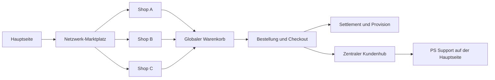

# PS MarketPress


**Die vollständige E-Commerce- und Marketplace-Lösung für ClassicPress und Multisite.**

[](https://www.classicpress.net/)
[](https://www.php.net/)
[](https://www.gnu.org/licenses/gpl-3.0.html)
[](https://github.com/Power-Source/marketpress/releases/latest)

PS MarketPress betreibt sowohl eigenständige Onlineshops als auch komplette Shop-Netzwerke. Produkte, Varianten, Bestellungen, Zahlungen, Versand, digitale Downloads und Kundenprozesse sind direkt enthalten. Im Multisite-Betrieb wird daraus eine zentrale Marketplace-Plattform mit globalem Warenkorb, Shopprofilen, Kundenhub, Provisionsabrechnung und gezielter Rechteverwaltung.

Keine Pflicht-Erweiterungen, keine Funktionssperren und keine laufenden Lizenzkosten.

## Warum PS MarketPress?

- **Ein Plugin für Shop und Marktplatz:** vom einzelnen Store bis zum Netzwerk mit vielen eigenständigen Verkäufern.
- **Multisite als Kernfunktion:** globale Produktlisten, zentrale Navigation, Shopprofile und netzwerkweite Bestellprozesse.
- **Vollständiger Commerce-Workflow:** Produkte, Varianten, Lager, Steuern, Gutscheine, Checkout, Versand und Bestellverwaltung.
- **Digitale Produkte:** geschützte Downloads, Downloadlimits, kostenlose Downloads und mehrere Dateien pro Produkt.
- **Kundenorientierte Prozesse:** Bestellsuche, Zahlungswiederholung, Bewertungen und digitale Widerrufsverwaltung.
- **Offen und erweiterbar:** Shortcodes, Widgets, Hooks, interne Add-ons und Integrationen mit dem PSOURCE-Ökosystem.

## Netzwerk und Marketplace

PS MarketPress behandelt Multisite nicht als nachträgliche Ergänzung. Netzwerkfunktionen greifen direkt in Produktdarstellung, Warenkorb, Checkout, Bestellungen und Abrechnung ein.

### Zentraler Marktplatz

- Produkte aus allen freigegebenen Shops auf der Hauptseite darstellen
- Netzwerkweite Kategorien, Schlagwörter und Filter
- Dynamische Links zu Produkten und Shops im richtigen Blog-Kontext
- Wahlweise direkte Produktansicht oder zentrale Shop-Profilseite
- Globaler Warenkorb über mehrere Shops hinweg
- Steuerbarer Floating-Warenkorb auf der Hauptseite

### Shopprofile

- Eigene Profilseiten für Verkäufer-Shops
- Branding, Beschreibung, Links und Social-Media-Angaben
- Tabs für Produkte, Gutscheine und Bewertungen
- Kategorie-Vorfilterung und AJAX-gestützte Navigation
- Optionale Shopbewertungen im Netzwerk

### Zentraler Kundenhub

- Bestellungen aus allen beteiligten Shops in einer Übersicht
- Gesamtumsatz, offene Lieferungen und ausstehende Bewertungen
- Globaler Warenkorb und Produktempfehlungen
- Widerrufsstatus je Bestellung
- Direkter Zugang zum zentralen Hauptseiten-Support
- Snapshot-basierte Datenaufbereitung für kurze Ladezeiten

### Provisionen und Auszahlungen

- Konfigurierbare Marketplace-Provision
- Berechnungsbasis und Steueranteil einstellbar
- Haltefristen und automatische Freigabe
- Zentrales Settlement-Ledger
- Moderation von Freigaben, Sperren und Auszahlungen
- Eigene Abrechnungsansicht für Shopbetreiber
- Separates Recht `manage_settlement_approvals` für den Freigabe-Workflow



## Shop-Funktionen

### Produkte und Verkauf

- Physische und digitale Produkte
- Produktvarianten mit eigenen Preisen, Beständen, Bildern und Beschreibungen
- Sonderpreise, Produktlimits und Lagerverwaltung
- Produktbilder, Galerien und Video-URLs
- Verwandte, beliebte und hervorgehobene Produkte
- Externe Produkt- und Kaufen-Links
- Checkout als registrierter Benutzer oder Gast

### Bestellungen und Kunden

- Zentrale Bestellverwaltung mit Status- und Aktionsfiltern
- Bestellsuche für Kunden und Gäste
- Erneuter Zahlungsversuch bei offenen Bestellungen
- E-Mail-Benachrichtigungen mit anpassbaren Vorlagen
- Produktbewertungen mit Sternebewertung und Hilfreich-Funktion
- PDF-Rechnungen und Lieferscheine
- Export- und Statistikfunktionen

### Digitaler Widerruf

- Digitale Widerrufserklärung in zwei Schritten
- Sofortige Eingangsbestätigung per E-Mail
- Widerrufsfähigkeit und Ausschlussgrund pro Produkt
- Unveränderlicher Snapshot der bestellten Positionen
- Kundenstatus von Eingang bis Erstattung oder Abschluss
- Admin-Bearbeitung mit internem Status und Notiz
- Netzwerkweite Übersicht im zentralen Kundenhub

## PSOURCE-Integrationen

### PS Support

Die optionale Integration verbindet Bestellungen direkt mit dem zentralen Supportsystem:

- Bestellbezogene Supportanfragen aus Kundenbereich und Bestellhistorie
- Zentrale Ticketablage auf der konfigurierten Hauptseite
- Erhalt des zuständigen Shops als Ticket- und Bestellkontext
- Zentrale FAQ-Seite und produktspezifische FAQ-Verknüpfungen
- Automatische Bereitstellung benötigter Supportseiten in Multisite
- Berechtigungsprüfung im tatsächlichen Support-Kontext

### PS Bloghosting / Pro Sites

Für kommerzielle Shop-Netzwerke können Funktionen nach Tariflevel freigeschaltet werden:

- MarketPress-Zugriff je Bloghosting-Level
- Verfügbare Zahlungs-Gateways nach Tarif
- Verfügbare Shop-Themes nach Tarif
- Automatische Berücksichtigung des aktiven Levels eines Subshops

### PS Update Manager

Der [PSOURCE Update Manager](https://github.com/Power-Source/ps-update-manager/releases/latest) bündelt Installation und Aktualisierung von PSOURCE-Projekten. Damit lassen sich PS MarketPress und ergänzende Plugins zentral aktuell halten.

### Integrierte Add-ons

- Gutscheine und Rabattcodes
- PDF-Rechnungen und Lieferscheine
- Mehrere Download-Dateien pro Produkt
- Produktkommentare und Bewertungen
- Shop-Statistiken mit Chart.js
- Netzwerk-Shopprofile
- PS-Bloghosting-Anbindung

## Zahlungsarten

PS MarketPress registriert folgende Zahlungs-Gateways:

- Stripe
- PayPal Express
- PayPal Marketplace / Commerce Platform
- Mollie
- Authorize.Net AIM
- eWay Shared Payments
- eWay Rapid 3.1 (Beta)
- Simplify Commerce by Mastercard
- Manuelle Zahlung
- Kostenlose Bestellungen

Die Verfügbarkeit kann im Netzwerk zentral eingeschränkt und mit PS Bloghosting zusätzlich an Tariflevel gekoppelt werden.

## Versand

- Pauschalpreis
- Abholung
- Versand nach Warenwert
- Versand nach Gewicht
- FedEx (Beta)
- UPS (Beta)
- USPS

Versandzonen, Zielländer, Steuern und produktspezifische Versanddaten lassen sich über die Shop-Einstellungen verwalten.

## Installation

### Voraussetzungen

- ClassicPress 2.7.1
- PHP 8.0 oder neuer
- Für Marketplace-Funktionen: aktiviertes ClassicPress-Multisite-Netzwerk

### Einzelshop

1. Die aktuelle Version aus den [Releases](https://github.com/Power-Source/marketpress/releases/latest) herunterladen.
2. Das Plugin nach `wp-content/plugins/marketpress` installieren.
3. **PS MarketPress** in der Pluginverwaltung aktivieren.
4. Den Einrichtungsassistenten öffnen und Shopseiten, Währung, Steuern, Versand und Zahlungen konfigurieren.
5. Produkte anlegen und den Checkout testen.

### Multisite und Marketplace

1. PS MarketPress netzwerkweit aktivieren.
2. In den Netzwerkeinstellungen den globalen Warenkorb und die gewünschten Marketplace-Funktionen einschalten.
3. Netzwerkseiten für Marktplatz, Kundenhub und Shopprofile zuweisen.
4. Gateways, Themes, Provisionen und Rechte zentral konfigurieren.
5. Optional PS Support und PS Bloghosting verbinden.

## Wichtige Shortcodes

### Shop

| Shortcode | Zweck |
| --- | --- |
| `[mp_list_products]` | Produktliste mit Filtern und Sortierung |
| `[mp_product]` | Einzelnes Produkt |
| `[mp_buy_button]` | Kaufen-Schaltfläche |
| `[mp_cart]` | Warenkorb |
| `[mp_checkout]` | Checkout |
| `[mp_order_status]` | Bestellsuche und Kundenbereich |
| `[mp_product_rating]` | Produktbewertung |
| `[mp_store_navigation]` | Shopnavigation |

### Netzwerk

| Shortcode | Zweck |
| --- | --- |
| `[mp_list_global_products]` | Produkte aus dem gesamten Netzwerk |
| `[mp_global_categories_list]` | Netzwerkweite Kategorien |
| `[mp_global_tag_cloud]` | Netzwerkweite Schlagwörter |
| `[mp_network_customer_hub]` | Zentraler Kundenhub |
| `[mp_network_shop_profile]` | Zentrale Shop-Profilseite |
| `[mp_network_shop_performance]` | Performance-Übersicht für Shops |
| `[mp_network_settlement_dashboard]` | Abrechnungsübersicht eines Shops |

Viele Shortcodes unterstützen zusätzliche Attribute. Die vollständigen Optionen sind in der [Dokumentation](https://psource.eimen.net/wiki/ps-marketpress-dokumentation/) beschrieben.

## Entwicklung und Erweiterung

PS MarketPress stellt zahlreiche Actions und Filter für Produkte, Warenkorb, Checkout, Bestellungen, Gateways, Versand, Multisite-Routing und Add-ons bereit. Eigene Integrationen können registriert werden, ohne den Plugin-Kern zu verändern.

Frontend-Assets werden mit Grunt gebaut:

```bash
npm install
npm run build
```

PHP-Abhängigkeiten sind über Composer definiert:

```bash
composer install
```

## Hilfe und Projektlinks

- [Dokumentation](https://psource.eimen.net/wiki/ps-marketpress-dokumentation/)
- [Releases](https://github.com/Power-Source/marketpress/releases/latest)
- [Quellcode und Issues](https://github.com/Power-Source/marketpress)
- [PSOURCE](https://psource.eimen.net/)
- [PS Update Manager](https://github.com/Power-Source/ps-update-manager/releases/latest)

## Lizenz

PS MarketPress ist freie Software und wird unter der **GNU General Public License v3.0 oder später** veröffentlicht.